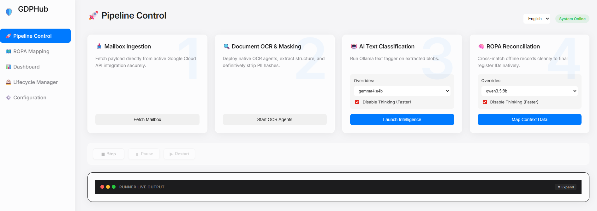

# 🛡️ GDPHub Privacy Hub

An automated Python pipeline that extracts, anonymizes, classifies, and maps enterprise documents and emails to your GDPR Record of Processing Activities (ROPA) — using local LLMs and SQLite.




---

## 🖱️ Quick Start

**Only prerequisite:** [Python 3.10+](https://www.python.org/downloads/)

### Windows

1. Double-click **`install.bat`**
2. Double-click **`start.bat`**

### macOS / Linux

```bash
chmod +x install.command start.command   # one-time only
./install.command
./start.command
```

The installer checks your system, installs Python packages & NLP models, and offers to set up [Ollama](https://ollama.com/) and [Tesseract OCR](https://github.com/tesseract-ocr/tesseract).  
Once started, open **http://localhost:8000** in your browser.

> [!NOTE]
> **Ollama** is required for AI classification (steps 2 & 4).  
> **Tesseract** is optional — only needed for scanned images / image-based PDFs.

---

## 🚀 Features

- **Multi-Source Ingestion** — Process local files or fetch emails + attachments from **Gmail** (OAuth2) and **Microsoft 365 / Outlook** (Graph API).
- **Text Extraction & OCR** — Built-in parsers for PDF, DOCX, DOC, ODT, RTF, JSON, HTML, XLS, CSV, TXT with Tesseract OCR fallback.
- **Privacy-First Anonymization** — [Microsoft Presidio](https://microsoft.github.io/presidio/) with bilingual NLP (Italian + English via spaCy). Detects names, emails, phones, IBANs, fiscal codes, IPs, and more — entirely offline.
- **LLM Classification** — Local [Ollama](https://ollama.com/) models produce structured JSON summaries and document classifications.
- **Human-In-The-Loop RAG** — Manual corrections to classifications or ROPA mappings are stored in a local [ChromaDB](https://www.trychroma.com/) vector database. Future pipeline runs retrieve the most similar past corrections and inject them as dynamic few-shot examples, so the LLM learns from your feedback over time.
- **ROPA Mapping & Retention** — Imports your corporate ROPA (Excel/CSV) and uses AI to match documents against processing activities with automatic retention tracking.
- **Lifecycle Management** — Tracks document lifespans mapped to ROPA retention windows.
- **Erasure Audit Report** — One-click PDF export proving GDPR Art. 17 compliance (creation → scheduled deletion → actual erasure).
- **Automated Secure Deletion** — Three-phase janitor (Cloud → Filesystem → Database) for expired documents, batch or per-document.
- **Web Interface** — Async FastAPI backend with a modern SPA frontend, real-time pipeline execution, progress tracking, and live log streaming.

---

## 🏗️ Pipeline

Six sequential scripts orchestrated via the WebUI or CLI:

| # | Script | Purpose |
|---|--------|---------|
| 0 | `extract_mail.py` | Syncs emails + attachments from Gmail or Outlook |
| 1 | `extract_text.py` | Extracts text, runs OCR, anonymizes PII, ingests into SQLite |
| 2 | `classify_text.py` | LLM-powered classification via Ollama (JSON-mode) |
| 3 | `extract_ropa.py` | Imports corporate ROPA registry (.xlsx / .ods / .csv) |
| 4 | `identify_ropa.py` | AI-driven matching of documents to ROPA processing activities |
| 5 | `document_deletion.py` | Secure deletion of expired documents (Cloud + Filesystem + DB) |

---

## 🔄 Human-In-The-Loop (HITL) Learning

GDPHub improves its AI accuracy over time by learning from your manual corrections:

1. **Correct via the UI** — Edit a document's classification or reassign its ROPA mapping through the web interface.
2. **Feedback is vectorized** — The correction is embedded using `nomic-embed-text` (via Ollama) and stored in a local ChromaDB database alongside the main SQLite DB.
3. **Future runs use your feedback** — When the classification or ROPA-matching pipeline processes a new document, it retrieves the top 2 most similar past corrections and injects them as few-shot examples into the LLM prompt.

**Requirements:** The `nomic-embed-text` embedding model must be available in Ollama:

```bash
ollama pull nomic-embed-text
```

ChromaDB data is persisted automatically in `data/output/chromadb/`. No additional configuration is needed.

---

## ⚙️ Manual Setup (Alternative)

If you prefer manual installation over the 1-click scripts:

```bash
pip install -r requirements.txt
python -m spacy download it_core_news_lg
python -m spacy download en_core_web_lg
```

Then install [Ollama](https://ollama.com/) and pull a model:

```bash
ollama pull qwen3.5:9b
ollama pull nomic-embed-text   # required for HITL feedback loop
```

**Run the web app:**

```bash
# Set PYTHONPATH first (Linux/macOS)
export PYTHONPATH="src"
# Windows CMD: set PYTHONPATH=src

python -m gdphub.api.main
# → http://localhost:8000
```

**Or run headless / CLI:**

```bash
python -m gdphub.pipelines.classify_text --model qwen3.5:9b --run-all --no-think
python -m gdphub.pipelines.identify_ropa --model qwen3.5:9b --no-think
python -m gdphub.pipelines.document_deletion --ids <UUID1> <UUID2> --force
```

---

## 🔑 Email Source Setup

<details>
<summary><strong>Gmail (Google OAuth2)</strong></summary>

1. Enable the **Gmail API** in [Google Cloud Console](https://console.cloud.google.com/).
2. Create an **OAuth Consent Screen** with scopes: `gmail.readonly`, `gmail.modify`, `mail.google.com`.
3. Generate an **OAuth Client ID** (Desktop app).
4. Enter the **Client ID** and **Client Secret** in the GDPHub Configuration page.
</details>

<details>
<summary><strong>Outlook / Microsoft 365 (Graph API)</strong></summary>

1. Register an app in [Azure Portal](https://portal.azure.com/) → **App registrations**.
2. Set redirect URI to `http://localhost` (Mobile and desktop applications).
3. Add API permissions: `Mail.Read`, `Mail.ReadWrite` (Microsoft Graph, Delegated).
4. Enter the **Application (client) ID** and **Tenant ID** in the GDPHub Configuration page.
</details>

---

## 🧠 Configuration

All settings are managed through the WebUI Configuration page (backed by SQLite). Key options:

| Setting | Description |
|---------|-------------|
| `active_source` | Pipeline target: `local`, `gmail`, or `outlook` |
| `input_folder` | Where emails are downloaded / documents are read from |
| `database_folder` | Location of the `GDPHub.db` SQLite database |
| `log_folder` | Log output directory (auto-rotated at 500 KB) |

Ollama model selection, extraction parameters, and email filters are all configurable from the WebUI — no manual file editing needed.

---

## 📅 Multi-ROPA Deletion Retention Handling

When a document/email matches multiple ROPA processing activities with different retention periods, the system automatically:
1. Maintains only a **single lifecycle record** per document ID in the `document_lifecycle` table.
2. Sets and dynamically updates the `scheduled_deletion_date` of that record to match the **maximum (latest) retention period** among all associated activities.

This behavior is enforced directly at the database level via specialized triggers (`trg_calculate_lifecycle_insert` and `trg_calculate_lifecycle_update`), ensuring compliance with GDPR Art. 17 guidelines (never deleting a document before its longest retention purpose has expired).

---

## 📄 License

[Apache License 2.0](LICENSE)

---

<br>

# 🇮🇹 Versione Italiana

# 🛡️ GDPHub Privacy Hub

Una pipeline Python automatizzata che estrae, anonimizza, classifica e mappa documenti ed email aziendali sul Registro dei Trattamenti (ROPA) ai fini GDPR — tramite LLM locali e SQLite.


---

## 🖱️ Avvio Rapido

**Unico prerequisito:** [Python 3.10+](https://www.python.org/downloads/)

### Windows

1. Doppio click su **`install.bat`**
2. Doppio click su **`start.bat`**

### macOS / Linux

```bash
chmod +x install.command start.command   # solo la prima volta
./install.command
./start.command
```

L'installer verifica il sistema, installa pacchetti Python e modelli NLP, e offre di configurare [Ollama](https://ollama.com/) e [Tesseract OCR](https://github.com/tesseract-ocr/tesseract).  
Una volta avviato, apri **http://localhost:8000** nel browser.

> [!NOTE]
> **Ollama** è necessario per la classificazione AI (step 2 e 4).  
> **Tesseract** è opzionale — serve solo per immagini scannerizzate / PDF basati su immagini.

---

## 🚀 Funzionalità

- **Acquisizione Multi-Sorgente** — Elabora file locali o estrae email + allegati da **Gmail** (OAuth2) e **Microsoft 365 / Outlook** (Graph API).
- **Estrazione Testo & OCR** — Parser integrati per PDF, DOCX, DOC, ODT, RTF, JSON, HTML, XLS, CSV, TXT con fallback Tesseract OCR.
- **Anonimizzazione Privacy-First** — [Microsoft Presidio](https://microsoft.github.io/presidio/) con NLP bilingue (Italiano + Inglese via spaCy). Rileva nomi, email, telefoni, IBAN, codici fiscali, IP e altro — interamente offline.
- **Classificazione LLM** — Modelli [Ollama](https://ollama.com/) locali producono riassunti JSON strutturati e classificazioni documentali.
- **Human-In-The-Loop RAG** — Le correzioni manuali a classificazioni o mappature ROPA vengono salvate in un database vettoriale [ChromaDB](https://www.trychroma.com/) locale. Le esecuzioni future della pipeline recuperano le correzioni passate più simili e le iniettano come esempi few-shot dinamici, così l'LLM impara dal tuo feedback nel tempo.
- **Mappatura ROPA & Conservazione** — Importa il ROPA aziendale (Excel/CSV) e usa l'IA per associare documenti alle attività di trattamento con tracciamento automatico della conservazione.
- **Gestione Ciclo di Vita** — Traccia la durata dei documenti mappata alle finestre di conservazione ROPA.
- **Report Audit di Cancellazione** — Esportazione PDF con un click a prova di conformità GDPR Art. 17 (creazione → cancellazione pianificata → cancellazione effettiva).
- **Cancellazione Sicura Automatizzata** — Janitor in tre fasi (Cloud → Filesystem → Database) per documenti scaduti, in batch o singolarmente.
- **Interfaccia Web** — Backend asincrono FastAPI con frontend SPA moderno, esecuzione pipeline in tempo reale, barra di avanzamento e streaming live dei log.

---

## 🏗️ Pipeline

Sei script sequenziali orchestrabili dalla WebUI o da CLI:

| # | Script | Scopo |
|---|--------|-------|
| 0 | `extract_mail.py` | Sincronizza email + allegati da Gmail o Outlook |
| 1 | `extract_text.py` | Estrae testo, esegue OCR, anonimizza PII, inserisce in SQLite |
| 2 | `classify_text.py` | Classificazione tramite LLM via Ollama (modalità JSON) |
| 3 | `extract_ropa.py` | Importa il registro ROPA aziendale (.xlsx / .ods / .csv) |
| 4 | `identify_ropa.py` | Associazione AI dei documenti alle attività ROPA |
| 5 | `document_deletion.py` | Cancellazione sicura dei documenti scaduti (Cloud + Filesystem + DB) |

---

## 🔄 Apprendimento Human-In-The-Loop (HITL)

GDPHub migliora la precisione dell'IA nel tempo imparando dalle tue correzioni manuali:

1. **Correggi dalla UI** — Modifica la classificazione di un documento o riassegna la sua mappatura ROPA dall'interfaccia web.
2. **Il feedback viene vettorializzato** — La correzione viene trasformata in embedding tramite `nomic-embed-text` (via Ollama) e salvata in un database ChromaDB locale accanto al database SQLite principale.
3. **Le esecuzioni future usano il tuo feedback** — Quando la pipeline di classificazione o mappatura ROPA elabora un nuovo documento, recupera le 2 correzioni passate più simili e le inietta come esempi few-shot nel prompt dell'LLM.

**Requisiti:** Il modello di embedding `nomic-embed-text` deve essere disponibile in Ollama:

```bash
ollama pull nomic-embed-text
```

I dati ChromaDB vengono salvati automaticamente in `data/output/chromadb/`. Non è necessaria alcuna configurazione aggiuntiva.

---

## ⚙️ Setup Manuale (Alternativo)

Se preferisci l'installazione manuale agli script 1-click:

```bash
pip install -r requirements.txt
python -m spacy download it_core_news_lg
python -m spacy download en_core_web_lg
```

Poi installa [Ollama](https://ollama.com/) e scarica un modello:

```bash
ollama pull qwen3.5:9b
ollama pull nomic-embed-text   # necessario per il ciclo di feedback HITL
```

**Avvia la web app:**

```bash
# Prima imposta il PYTHONPATH (Linux/macOS)
export PYTHONPATH="src"
# Windows CMD: set PYTHONPATH=src

python -m gdphub.api.main
# → http://localhost:8000
```

**Oppure esecuzione headless / CLI:**

```bash
python -m gdphub.pipelines.classify_text --model qwen3.5:9b --run-all --no-think
python -m gdphub.pipelines.identify_ropa --model qwen3.5:9b --no-think
python -m gdphub.pipelines.document_deletion --ids <UUID1> <UUID2> --force
```

---

## 🔑 Configurazione Sorgenti Email

<details>
<summary><strong>Gmail (Google OAuth2)</strong></summary>

1. Abilita la **Gmail API** nella [Google Cloud Console](https://console.cloud.google.com/).
2. Crea una **Schermata di consenso OAuth** con scope: `gmail.readonly`, `gmail.modify`, `mail.google.com`.
3. Genera un **OAuth Client ID** (Desktop app).
4. Inserisci **Client ID** e **Client Secret** nella pagina Configurazione di GDPHub.
</details>

<details>
<summary><strong>Outlook / Microsoft 365 (Graph API)</strong></summary>

1. Registra un'app nel [Portale Azure](https://portal.azure.com/) → **Registrazioni app**.
2. Imposta l'URI di reindirizzamento su `http://localhost` (Applicazione per dispositivi mobili e desktop).
3. Aggiungi permessi API: `Mail.Read`, `Mail.ReadWrite` (Microsoft Graph, Delegata).
4. Inserisci l'**ID applicazione (client)** e il **Tenant ID** nella pagina Configurazione di GDPHub.
</details>

---

## 🧠 Configurazione

Tutte le impostazioni sono gestite dalla pagina Configurazione della WebUI (su SQLite). Opzioni principali:

| Impostazione | Descrizione |
|--------------|-------------|
| `active_source` | Sorgente pipeline: `local`, `gmail` o `outlook` |
| `input_folder` | Cartella download email / lettura documenti |
| `database_folder` | Posizione del database SQLite `GDPHub.db` |
| `log_folder` | Directory dei log (rotazione automatica a 500 KB) |

Selezione modello Ollama, parametri di estrazione e filtri email sono tutti configurabili dalla WebUI — nessuna modifica manuale necessaria.

---

## 📅 Gestione Conservazione per Associazioni ROPA Multiple

Quando un documento o un'email corrisponde a più attività di trattamento ROPA con differenti periodi di conservazione, il sistema automaticamente:
1. Mantiene **un singolo record di ciclo di vita** per ciascun ID documento nella tabella `document_lifecycle`.
2. Imposta e aggiorna dinamicamente la data `scheduled_deletion_date` di quel record in base al **massimo (più lungo) periodo di conservazione** tra tutte le attività associate.

Questo comportamento è garantito a livello di database tramite trigger dedicati (`trg_calculate_lifecycle_insert` e `trg_calculate_lifecycle_update`), garantendo la conformità con l'Art. 17 GDPR (non eliminando un documento prima che il suo scopo di conservazione più lungo sia scaduto).

---

## 📄 Licenza

[Apache License 2.0](LICENSE)
