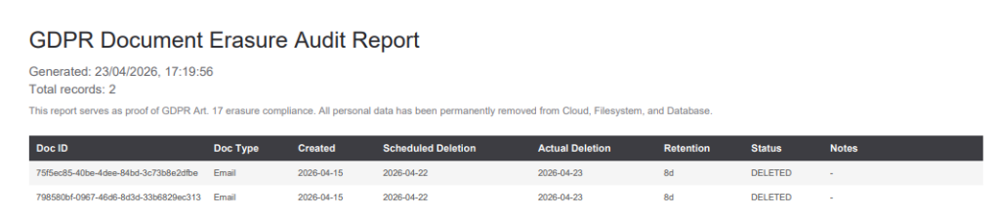

# 🛡️ GDPHub Privacy Hub

An advanced, automated Python pipeline designed to extract, anonymize, classify, and intelligently map enterprise documents and emails directly to your GDPR Record of Processing Activities (ROPA) utilizing local Large Language Models (LLMs) and a robust SQLite backbone.

---

## 🖱️ Quick Start (1-Click Deployment)

GDPHub ships with **ready-made scripts** so you can install and launch the full environment without typing a single command.

**The only prerequisite you need to install manually is [Python 3.10+](https://www.python.org/downloads/).** The installer script will check for everything else and guide you through any missing components.

| Prerequisite | Required? | Download Link |
|---|---|---|
| **Python 3.10+** | ✅ Required | [python.org/downloads](https://www.python.org/downloads/) |
| **Ollama** | ✅ Required for AI classification | [ollama.com](https://ollama.com/) |
| **Tesseract OCR** | ⬜ Optional — only for scanned images/OCR | [github.com/tesseract-ocr](https://github.com/tesseract-ocr/tesseract) |

> [!NOTE]
> **Tesseract is not mandatory.** It is only needed if you plan to process scanned images or image-based PDFs. The email pipeline, text extraction, and all other pipeline stages work perfectly without it.

### Windows

1. **Install dependencies:** Double-click **`install.bat`**. It will detect what's already installed, skip it, install missing Python packages, download spaCy NLP models, and offer to set up Ollama and Tesseract.
2. **Launch GDPHub:** Double-click **`start.bat`**. The server starts and your default browser opens to `http://localhost:8000`.

### macOS / Linux

1. **Make scripts executable** (one-time only):
   ```bash
   chmod +x install.command start.command
   ```
2. **Install dependencies:** Double-click **`install.command`** (or run `./install.command` in a terminal).
3. **Launch GDPHub:** Double-click **`start.command`** (or run `./start.command` in a terminal).

> [!NOTE]
> On macOS, you may need to right-click → **Open** the `.command` files the first time to bypass Gatekeeper.

---

## 🚀 Key Features

- **Unified Data Sourcing:** Natively process directories of local files or securely fetch live emails and attachments from **Gmail** (Google OAuth2) or **Microsoft 365 / Outlook** (Microsoft Graph API). Attachments are parsed intelligently, maintaining strict hierarchical inheritance (`parent_id`, `type`).
- **Robust OCR & Text Extraction:** Built-in parsers for PDF, DOCX, DOC, ODT, RTF, JSON, HTML, XLS, CSV, and TXT. Features fallback OCR utilizing Tesseract for image-based payloads.
- **Privacy-First Anonymization:** Powered by [Microsoft Presidio](https://microsoft.github.io/presidio/) with dual-language NLP models (Italian + English via spaCy). Detects and masks PII including names, emails, phone numbers, IBAN codes, credit cards, IP addresses, Italian fiscal codes, and EU license plates — entirely offline before data reaches the AI context window.
- **LLM-Powered Classification:** Integrates with [Ollama](https://ollama.com/) deployed locally to safely predict and evaluate document properties entirely offline, leveraging strict JSON-mode outputs for maximum consistency.
- **Intelligent ROPA Mapping & Retention:** Ingests your corporate Record of Processing Activities (Excel/CSV) and utilizes AI to confidently cross-evaluate your anonymized documents against registry tasks to output mapped associations. Fully tracks and resolves numeric Retention Periods dynamically.
- **Lifecycle Management:** Dedicated management module for tracking and auditing document lifespans natively mapped to the corresponding ROPA retention windows.
- **GDPR Erasure Audit Report:** One-click PDF export of the complete document lifecycle history — from creation through scheduled deletion to actual erasure — providing verifiable proof of GDPR Art. 17 compliance.
- **Automated Secure Deletion (Janitor):** Secure three-phase deletion workflow (Cloud → Filesystem → Database) for expired documents, supporting both automated batch runs and manual per-document deletion.
- **Web Interface:** A modern Single Page Application (WebUI) powered by an asynchronous FastAPI backend, featuring a glassmorphism-inspired design with real-time pipeline execution, progress tracking, and live log streaming.



---

## 🏗️ Pipeline Architecture

The processing workflow is composed of safely decoupled scripts driven centrally by a SQLite configuration database and synchronized via a centralized `GDPHub.db` schema. These scripts are executed sequentially:

1. **`0_extract_mail.py`**: A secure email sync agent. Connects to Gmail (Google API) or Outlook (Microsoft Graph API) to pull raw text and intelligently un-nest complex attachments to their host message boundaries, classifying items as `Email`, `File`, or `Attachment`.
2. **`1_extract_text.py`**: The central ingestion core. Analyzes the unified input directory to extract text. It normalizes unstructured documents, performs OCR on blind mediums, anonymizes PII via Presidio, and ingests them into the SQLite registry.
3. **`2_classify_text.py`**: Connects to your local Ollama endpoint using structured JSON-mode output generation. The AI processes the anonymized text and produces intelligent structural summaries and document classifications.
4. **`3_extract_ROPA.py`**: Dedicated module to standardize physical `.xlsx`, `.ods`, and `.csv` corporate registries into the standard internal SQL ROPA schema with full retention period parsing.
5. **`4_identify_ROPA.py`**: The reconciliation agent. Reads the LLM classifications and rigorously matches their profiles against the formalized processing registers for conclusive auditing.
6. **`5_document_deletion.py`**: The automated Janitor. Identifies documents past their retention window and securely removes them across Cloud (Gmail Trash / Outlook Deleted Items), Filesystem, and Database in an atomic, idempotent workflow.

---

## ⚙️ Prerequisites

To run GDPHub correctly, ensure the physical host complies with the environmental prerequisites below:

### 1. Core Environmental Software
* **Python 3.10+**
* **Local LLM Server:** Install [Ollama](https://ollama.com/) locally. Ensure you pull the default configured inference model before running the pipeline (e.g., `ollama pull gemma3:4b`).
* **Tesseract OCR (Optional):** Only required if you need to process scanned images or image-based PDFs. Not needed for the email pipeline or text-based document processing.
  * *Windows:* Download the `.exe` installer. Update the physical absolute `tesseract_path` executable route under `extract_text.py` in the Configuration page.
  * *Linux/Mac:* `sudo apt install tesseract-ocr` / `brew install tesseract`.
* **spaCy NLP Models:** Required by the Presidio anonymization engine:
  ```bash
  python -m spacy download it_core_news_lg
  python -m spacy download en_core_web_lg
  ```

### 2. Python Dependencies
Ensure your environment is provisioned with all library structures required by the extraction engines and web server:

```bash
pip install -r requirements.txt
```
*(Packages include fastapi, uvicorn, pytesseract, PyMuPDF, python-docx, Pillow, xlrd, striprtf, odfpy, pandas, openpyxl, tqdm, ollama, sqlmodel, presidio-analyzer, presidio-anonymizer, spacy, Google APIs, msgraph-sdk, and azure-identity).*

> **Note:** For native Windows legacy `.doc` extraction via Word COM interfaces, `pywin32` is additionally required (automatically included on Windows via `requirements.txt`).

### 3. Google Workspace OAuth (Gmail Source Only)
If utilizing Gmail as a data source via `0_extract_mail.py`:
1. Open the [Google Cloud Console](https://console.cloud.google.com/).
2. Enable the **Gmail API**.
3. Create an **OAuth Consent Screen** and add the required scopes: `gmail.readonly`, `gmail.modify`, and `mail.google.com`.
4. Generate an **OAuth Client ID** for a "Desktop app".
5. Download the resultant JSON and rename it strictly to `credentials.json`, persisting it securely within the `src/` directory.

### 4. Microsoft Azure App Registration (Outlook / Microsoft 365 Source Only)
If utilizing Outlook as a data source via `0_extract_mail.py`:
1. Open the [Azure Portal](https://portal.azure.com/) → **App registrations** → **New registration**.
2. Set the redirect URI to `http://localhost` (type: Mobile and desktop applications).
3. Under **API permissions**, add: `Mail.Read` and `Mail.ReadWrite` (Microsoft Graph, Delegated).
4. Copy the **Application (client) ID** and configure it in the GDPHub Configuration page under "Outlook Extraction Engine".
5. Set the **Tenant ID** to `common` for personal accounts, or your specific directory ID for organizational accounts.

---

## 🧠 Configuration Management

All configuration is managed through a centralized SQLite database, accessible visually from the integrated WebUI Configuration page. Initial bootstrap paths are seeded from `config.json`:

* **`active_source`**: Determines the pipeline's runtime target (`local`, `gmail`, or `outlook`).
* **`input_folder`**: A globally unified directory path. It represents both where `0_extract_mail.py` stores downloaded email payloads and where `1_extract_text.py` seeks items for processing.
* **`log_folder`**: Your global logging endpoint. Every pipeline script utilizes Python's RotatingFileHandlers to safely output streaming context bounds at <= 500KB intervals, preventing log bloat.
* **`database_folder`**: Identifies the output location for the centralized `GDPHub.db` SQLite database.

*You may dynamically manage all settings — including Ollama model selection, extraction parameters, and email query filters — directly from the integrated WebUI without editing any files manually.*

---

## 🚀 Getting Started

**Option A: Running the Web Application (Recommended)**
Launch the unified FastAPI-mounted WebUI by running:

```bash
# Launch the local Web API and frontend host
python src/api.py
```
*Navigate your browser to `http://localhost:8000/` to graphically orchestrate your configuration and pipeline scripts.*

**Option B: Strictly Headless / CLI**
If orchestrating from system crons or headless clusters, you may explicitly execute the files in chronological order from `0_extract_mail.py` to `5_document_deletion.py` inside the `src/` directory. Scripts accept optional CLI arguments directly:

```bash
python src/2_classify_text.py --model gemma3:4b --run-all --no-think
python src/4_identify_ROPA.py --model gemma3:4b --no-think
python src/5_document_deletion.py --ids <UUID1> <UUID2> --force
```

---

<br>
<hr>
<br>

# 🇮🇹 Versione Italiana (Italian Version)

# 🛡️ GDPHub Privacy Hub

Un'avanzata pipeline Python automatizzata, progettata per estrarre, anonimizzare, classificare e mappare in modo intelligente documenti ed email aziendali, integrandoli direttamente con il Registro dei Trattamenti (ROPA) ai fini GDPR tramite l'utilizzo di Modelli Linguistici (LLM) eseguiti in locale e un solido backend SQLite.

---

## 🖱️ Avvio Rapido (Installazione 1-Click)

GDPHub include **script pronti all'uso** per installare e avviare l'intero ambiente senza digitare un solo comando.

**L'unico prerequisito da installare manualmente è [Python 3.10+](https://www.python.org/downloads/).** Lo script di installazione verificherà tutto il resto e ti guiderà nell'installazione dei componenti mancanti.

| Prerequisito | Obbligatorio? | Link Download |
|---|---|---|
| **Python 3.10+** | ✅ Obbligatorio | [python.org/downloads](https://www.python.org/downloads/) |
| **Ollama** | ✅ Obbligatorio per la classificazione AI | [ollama.com](https://ollama.com/) |
| **Tesseract OCR** | ⬜ Opzionale — solo per immagini scannerizzate/OCR | [github.com/tesseract-ocr](https://github.com/tesseract-ocr/tesseract) |

> [!NOTE]
> **Tesseract non è obbligatorio.** È necessario solo se prevedi di elaborare immagini scannerizzate o PDF basati su immagini. La pipeline email, l'estrazione testo e tutte le altre fasi funzionano perfettamente senza di esso.

### Windows

1. **Installa dipendenze:** Fai doppio click su **`install.bat`**. Rileverà automaticamente cosa è già installato, salterà i componenti presenti, installerà i pacchetti Python mancanti, scaricherà i modelli NLP spaCy, e offrirà di configurare Ollama e Tesseract.
2. **Avvia GDPHub:** Fai doppio click su **`start.bat`**. Il server si avvia e il browser predefinito si apre su `http://localhost:8000`.

### macOS / Linux

1. **Rendi eseguibili gli script** (solo la prima volta):
   ```bash
   chmod +x install.command start.command
   ```
2. **Installa dipendenze:** Fai doppio click su **`install.command`** (oppure esegui `./install.command` da terminale).
3. **Avvia GDPHub:** Fai doppio click su **`start.command`** (oppure esegui `./start.command` da terminale).

> [!NOTE]
> Su macOS, potrebbe essere necessario fare click destro → **Apri** sui file `.command` la prima volta per superare il Gatekeeper.

---

## 🚀 Funzionalità Principali

- **Fonti Dati Unificate:** Elabora cartelle locali o estrae email e allegati in tempo reale e in sicurezza da caselle **Gmail** (Google OAuth2) o **Microsoft 365 / Outlook** (Microsoft Graph API). Supporta l'innesto intelligente degli allegati ereditando relazioni genitore-figlio (`parent_id`, `type`).
- **OCR Esteso & Estrazione Testo:** Supporto integrato per PDF, DOCX, DOC, ODT, RTF, JSON, HTML, XLS, CSV e TXT. Include un fallback automatico per Tesseract OCR sui payload d'immagine.
- **Anonimizzazione Privacy-First:** Basata su [Microsoft Presidio](https://microsoft.github.io/presidio/) con modelli NLP bilingue (Italiano + Inglese via spaCy). Rileva e maschera dati personali inclusi nomi, email, numeri di telefono, codici IBAN, carte di credito, indirizzi IP, codici fiscali e targhe EU — interamente offline prima che i dati raggiungano il contesto IA.
- **Classificazione tramite LLM:** Interfacciato con [Ollama](https://ollama.com/) per analizzare e descrivere le proprietà dei documenti operando in sicura assenza di rete, vincolando l'output in rigido formato JSON strutturato.
- **Mappatura ROPA & Ritenzione:** Legge il tuo Registro dei Trattamenti aziendale (Excel/CSV) e utilizza l'IA per confrontare i documenti anonimizzati con le attività a registro. Mappa automaticamente le tempistiche di conservazione.
- **Gestore Ciclo di Vita (Lifecycle):** Modulo dedicato alla tracciabilità, valutazione ed esecuzione delle scadenze documentali a norma secondo le indicazioni stabilite dal ROPA mappato.
- **Report Audit di Cancellazione GDPR:** Esportazione PDF con un click dell'intera cronologia del ciclo di vita documentale — dalla creazione alla cancellazione pianificata fino alla cancellazione effettiva — fornendo prova verificabile della conformità all'Art. 17 del GDPR.
- **Cancellazione Sicura Automatizzata (Janitor):** Flusso di cancellazione sicura in tre fasi (Cloud → Filesystem → Database) per documenti scaduti, con supporto sia per esecuzioni automatiche in batch sia per cancellazioni manuali per singolo documento.
- **Interfaccia Web:** Una moderna Single Page Application (WebUI) servita da un backend asincrono FastAPI, con design glassmorphism, esecuzione pipeline in tempo reale, barra di avanzamento e streaming live dei log.


---

## 🏗️ Architettura della Pipeline

Il flusso di lavoro si articola in script disaccoppiati gestiti da un database di configurazione SQLite e centralizzati dal database `GDPHub.db`. Tali scripts lavorano sequenzialmente:

1. **`0_extract_mail.py`**: Agente sicuro per la sincronizzazione email. Si connette a Gmail (Google API) o Outlook (Microsoft Graph API) per estrarre testo e scompattare allegati complessi, distinguendo i file fra `Email`, `File` e `Attachment`.
2. **`1_extract_text.py`**: Motore centrale di acquisizione file. Analizza le cartelle, normalizza documenti non strutturati, decifra le immagini con OCR, anonimizza i dati personali tramite Presidio e li inserisce nel registro relazionale SQLite.
3. **`2_classify_text.py`**: Si connette al server Ollama locale forzando output JSON strutturati. L'IA processa i documenti anonimizzati producendo classificazioni e sintesi mirate.
4. **`3_extract_ROPA.py`**: Modulo che consente l'allineamento rapido del registro aziendale fisico (.xlsx, .csv) in una matrice operativa ROPA standard all'interno di SQLModel.
5. **`4_identify_ROPA.py`**: L'agente di riconciliazione. Valuta le classificazioni prodotte e le correla alle attività presenti sul registro formalizzato aziendale per audit.
6. **`5_document_deletion.py`**: Il Janitor automatizzato. Identifica i documenti oltre la finestra di conservazione e li rimuove in sicurezza attraverso Cloud (Cestino Gmail / Elementi Eliminati Outlook), Filesystem e Database in un flusso atomico e idempotente.

---

## ⚙️ Prerequisiti

Per eseguire correttamente GDPHub, assicurati che la macchina di esecuzione supporti i seguenti requisiti:

### 1. Elementi Software Principali
* **Python 3.10+**
* **Server LLM Locale:** Installa [Ollama](https://ollama.com/) e scarica un modello AI target prima del lancio (Es: `ollama pull gemma3:4b`).
* **Tesseract OCR (Opzionale):** Necessario solo per elaborare immagini scannerizzate o PDF basati su immagini. Non richiesto per la pipeline email o l'elaborazione di documenti testuali.
  * *Windows:* Scarica il file installer `.exe`. Aggiorna il percorso `tesseract_path` dalla pagina di Configurazione della WebUI.
  * *Linux/MacOS:* `sudo apt install tesseract-ocr` o similare.
* **Modelli NLP spaCy:** Richiesti dal motore di anonimizzazione Presidio:
  ```bash
  python -m spacy download it_core_news_lg
  python -m spacy download en_core_web_lg
  ```

### 2. Dipendenze Librerie Python
Installa tutte le librerie richieste dal cluster applicativo:

```bash
pip install -r requirements.txt
```

> **Nota:** Lo snapshot per l'estrazione locale via OLE documentale in ambienti nativi Windows per Word `.doc` legacy necessita il framework `pywin32` (incluso automaticamente su Windows via `requirements.txt`).

### 3. Autenticazione Google Workspace (Solo Sorgente Gmail)
Se utilizzi Gmail come sorgente dati tramite `0_extract_mail.py`:
1. Recati sul portale [Google Cloud Console](https://console.cloud.google.com/).
2. Abilita le risorse per **Gmail API**.
3. Crea una **Schermata di consenso OAuth** e aggiungi gli scope richiesti: `gmail.readonly`, `gmail.modify` e `mail.google.com`.
4. Genera credenziali di tipo **OAuth Client ID** per applicativo "Desktop app".
5. Scarica il JSON, rinominalo in `credentials.json` e conservalo nella cartella `src/`.

### 4. Registrazione App Microsoft Azure (Solo Sorgente Outlook / Microsoft 365)
Se utilizzi Outlook come sorgente dati tramite `0_extract_mail.py`:
1. Vai sul portale [Azure Portal](https://portal.azure.com/) → **Registrazioni app** → **Nuova registrazione**.
2. Imposta l'URI di reindirizzamento su `http://localhost` (tipo: Applicazione per dispositivi mobili e desktop).
3. In **Autorizzazioni API**, aggiungi: `Mail.Read` e `Mail.ReadWrite` (Microsoft Graph, Delegata).
4. Copia l'**ID applicazione (client)** e configuralo nella pagina Configurazione di GDPHub sotto "Outlook Extraction Engine".
5. Imposta il **Tenant ID** su `common` per account personali, o l'ID directory specifico per account aziendali.

---

## 🧠 Gestione della Configurazione

La configurazione è gestita centralmente tramite un database SQLite, accessibile visualmente dalla pagina Configurazione della WebUI. I percorsi iniziali sono importati da `config.json`:

* **`active_source`**: Direttiva sorgente operativa (`local`, `gmail` o `outlook`).
* **`input_folder`**: Percorso unificato globale da cui partono download email ed estrazioni.
* **`log_folder`**: Dispositivo dove convergeranno i log globali, preservato da overflow tramite `RotatingFileHandlers`.
* **`database_folder`**: Coordinate del database relazionale unico `GDPHub.db`.

*Tutti i parametri — inclusa selezione modello Ollama, parametri di estrazione e filtri email — sono gestibili direttamente dalla WebUI senza modificare file manualmente.*

---

## 🚀 Avvio Esecuzione

**Opzione A: Web App Nativa Integrata (Consigliato)**
Altamente consigliato per godere di connettività unificata e controlli operativi esposti dal backend asincrono FastAPI:

```bash
# Avvia il processo web nativo SPA e FastAPI
python src/api.py
```
*Troverai la dashboard ospitata col tuo browser all'indirizzo `http://localhost:8000/`.*

**Opzione B: Headless / Terminali (CLI)**
Per ambienti headless o clusters, esegui gli script in ordine crescente dalla cartella `src/`, con supporto completo per flag CLI:

```bash
python src/2_classify_text.py --model gemma3:4b --run-all --no-think
python src/4_identify_ROPA.py --model gemma3:4b --no-think
python src/5_document_deletion.py --ids <UUID1> <UUID2> --force
```
